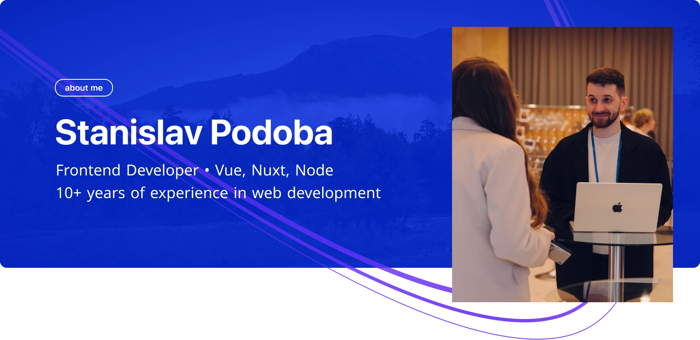

**Frontend Developer with 10+ years of experience, focused on Vue / Nuxt applications with strong attention to UX, code readability, and long-term maintainability.**
I build clean, well-structured interfaces, document architectural decisions, and care about predictable behavior, scalability, and developer experience. I’ve worked on long-lived projects where code quality, documentation, and maintainability matter more than quick wins.

### Technologies

**Advanced**

- HTML, CSS/SASS, JavaScript
- Git — daily workflow
- Figma, UX / UI — working closely with design and usability

**Intermediate**

- Vue / Nuxt — component-based architecture
- SSR / SPA — real-world application experience
- Node.js — basic backend and tooling
- BEM — structured CSS methodology

**Basic**

- TypeScript — gradual adoption in frontend projects